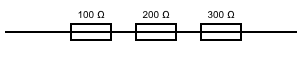
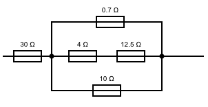
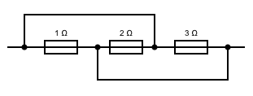
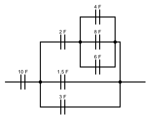
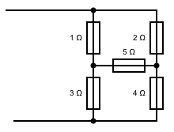

<link rel="stylesheet" href="css/index.css">

## Equivalent Circuit Calculator

Diagram the parallel/series\* circuit of resistors or capacitors below as a comma-separated list of numbers and arrays. Numbers (integer or decimal) represent resistance or capacitance values. Using nested arrays, you can indicate parallel branches. 

<form>
    <input type="radio" checked="checked" name="component" value="resistor">&nbsp;Resistor circuit 
    <input type="radio" name="component" value="capacitor">&nbsp;Capacitor circuit
</form>

<textarea id="circuit"></textarea>

<button type="button" value="calculate" id="calculate">Calculate</button>

\* For more [complex topologies](https://en.wikipedia.org/wiki/Topology_(electrical_circuits)), you will need a different tool.

---

### Diagram Examples

    100, 200, 300

    30, [[0.7], [4, 12.5], [10]]

    [[3], [2], [1]]

    10, [
            [2, [
                    [4], 
                    [8], 
                    [6]
                ]
            ], 
            [1.5], 
            [3]
        ]

No can do!

